# NXT School ERP — Architecture, Schema aur Migration ka Naksha

Ye document 4 diagram me poori tasveer deta hai:

1. **Aaj ka architecture** — code kis tarah chalta hai
2. **Code ka logic** — data andar-bahar kaise aata-jaata hai
3. **Database schema** — RTDB ke 57 node → Postgres ki tables
4. **Migration flow** — agar Supabase pe jaana ho to kis kram me

> Faisla is document ka hissa nahi hai. Uske liye [FIREBASE_VS_SUPABASE_DECISION.md](FIREBASE_VS_SUPABASE_DECISION.md) dekh.
> Line-by-line code ka farak [FIREBASE_VS_SUPABASE_GUIDE.md](FIREBASE_VS_SUPABASE_GUIDE.md) me hai.

---

## 1. Aaj ka Architecture

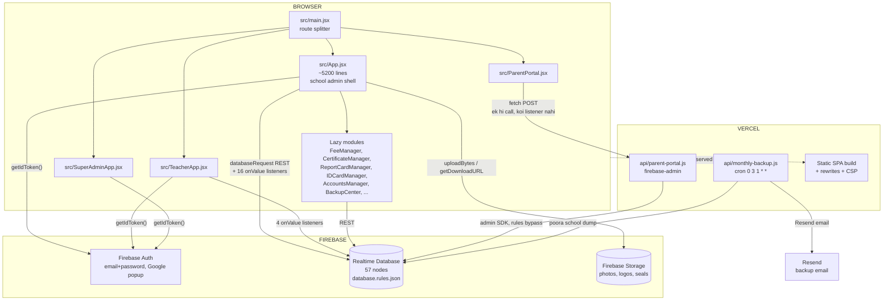

### Padhne layak baatein

- **`src/App.jsx` hi asli app hai.** Auth, session, sidebar, dashboard, admissions, students, settings — sab isi me. Baaki manager files isi se lazy import hote hain.
- **Do raaste hain data tak** — `databaseRequest()` (ek-baar ka REST call) aur `onValue` listener (live). Dono ek hi RTDB pe.
- **Parent portal alag hai.** Wo seedhe Firebase se baat karta hi nahi — sirf `api/parent-portal.js` se. Isiliye parent ke paas **realtime hai hi nahi**, refresh pe hi update hota hai. (Ye Supabase pe jaane se badalta nahi.)
- **Super Admin console sirf Ayush ke liye hai.**

---

## 2. Code ka Logic — data andar-bahar kaise chalta hai

### 2a. Login se dashboard tak

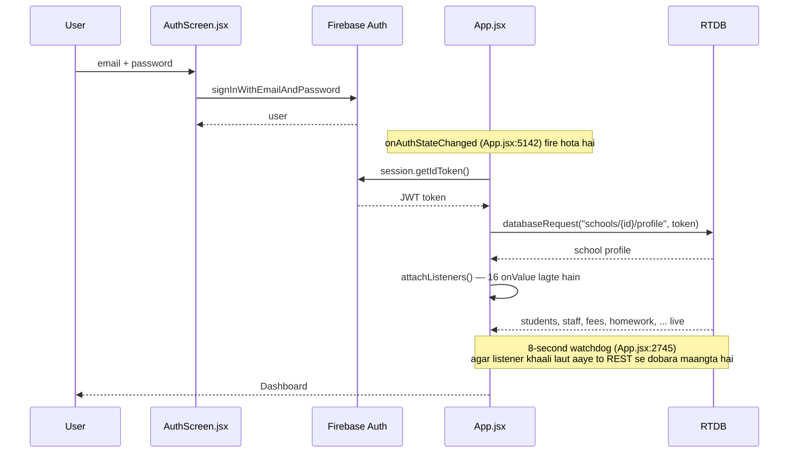

**Watchdog kyun hai:** ek baar Firebase SDK ka websocket flag kharab ho gaya tha aur listeners khaali data laut rahe the (commit `cea0bd3`). Ab har critical listener ke peeche 8-second ka REST fail-safe hai.

### 2b. Data access ke teen tareeke

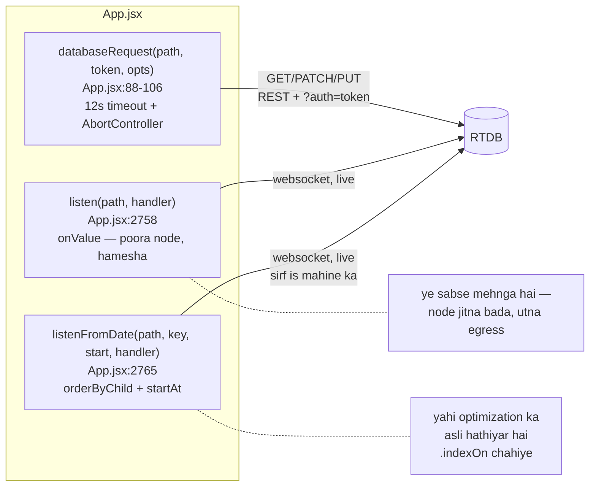

**Yahi egress ka poora khel hai.** `listen()` poora node kheenchta hai — 1000 students = har login pe poora students node. `listenFromDate()` sirf current month ka attendance laata hai. Optimization ka matlab hai `listen` ko `listenFromDate` ya rollup me badalna.

### 2c. Attendance — ek pooora write path

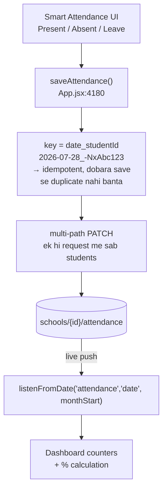

Har row me abhi 10 field hain: `id`, `studentId`, `student_id`, `class`, `section`, `date`, `status`, `statusText`, `mark`, `markedBy`. RTDB me **har row ke saath ye 10 naam bhi store hote hain** (~66 byte sirf naamon ka).

### 2d. Photo upload

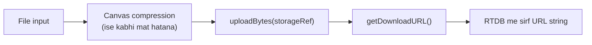

**Pehle photos base64 me RTDB ke andar hi ja rahi thi** — ~133 KB per student. Wahi app ka sabse bada read tha. `migrateInlinePhotos` ne unhe Storage pe bheja. Ab RTDB me sirf URL rehta hai.

---

## 3. Database Schema — RTDB se Postgres

### 3a. Aaj ka RTDB shape

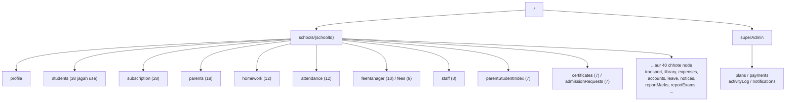

**Kul 57 distinct node.** Har node ek JSON object hai jiski keys push-IDs hain.

### 3b. Postgres me kaisa dikhega

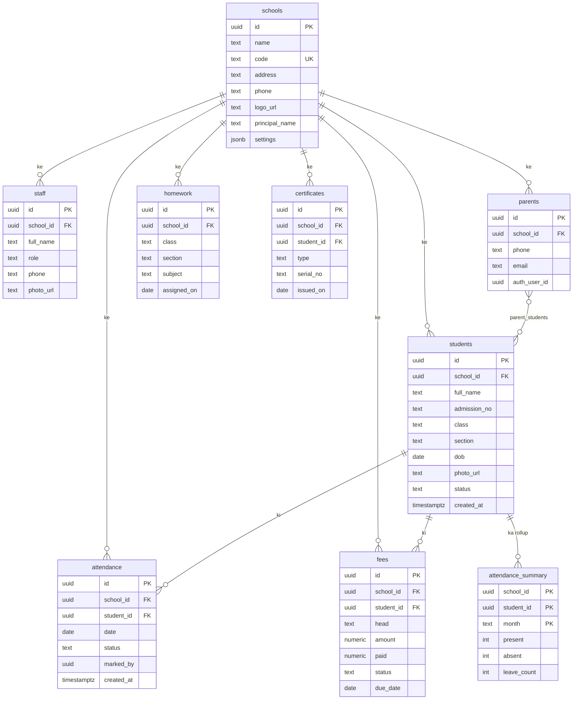

### 3c. Do sabse zaroori design decisions

**1. `attendance` ki row patli ho jaati hai**

| | RTDB | Postgres |
|---|---|---|
| Field naam | har row me dobara | table me ek baar |
| Duplicate field | `studentId` + `student_id`, `status` + `statusText` + `mark` | ek-ek |
| Per row | ~225 byte | ~100 byte |

`class` aur `section` bhi hata sakte hain — wo `students` se join ho jaate hain.

**2. `attendance_summary` — rollup table**

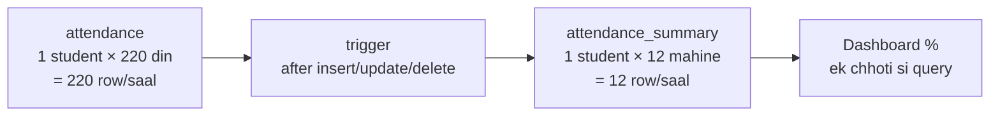

**Yahi 15-school wala aankda deta hai.** Purana attendance archive karke sirf summary rakho, to storage 18x kam ho jaata hai.

> **Zaroori baat:** ye Postgres ka jaadu nahi hai. **Ye Firebase me bhi ho sakta hai** — bas trigger nahi hai, to `saveAttendance()` ke waqt summary khud update karni padegi. Isiliye decision doc me kaha gaya hai ki ye kaam pehle Firebase me hi kar lo.

### 3d. RLS — rules ka Postgres wala roop

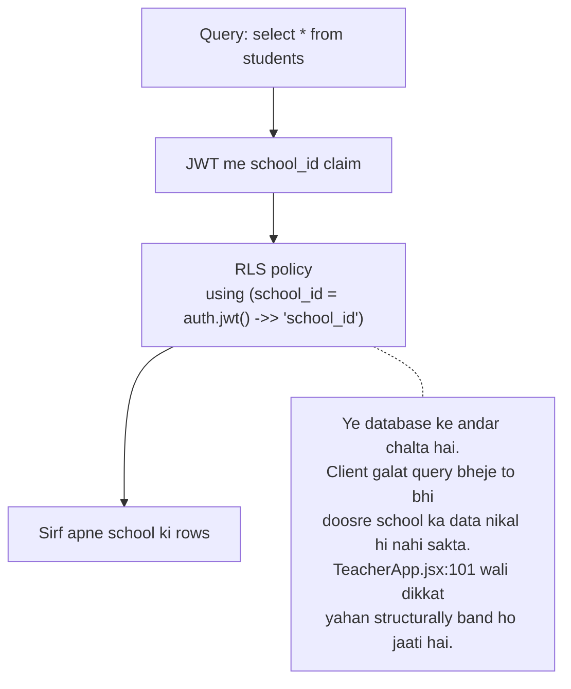

---

## 4. Migration Flow

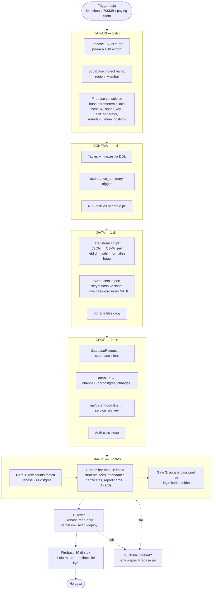

### Kaun kya karega

| # | Kaam | Kaun | Waqt |
|---|---|---|---|
| 1 | Firebase JSON dump | Claude | 5 min |
| 2 | Supabase project + region | Ayush | 10 min |
| 3 | Hash parameters console se | Ayush | 5 min |
| 4 | Schema DDL + indexes | Claude | 3 ghante |
| 5 | Rollup trigger | Claude | 1 ghanta |
| 6 | RLS policies | Claude | 3 ghante |
| 7 | Transform script | Claude | 4 ghante |
| 8 | Auth import | Claude | 1 ghanta |
| 9 | Storage copy | Claude | 1 ghanta |
| 10 | Code swap | Claude | 2 din |
| 11 | Gate 1/2/3 janch | **Ayush** | 3 ghante |
| 12 | Vercel env + deploy | Ayush | 30 min |

**Kul: 4-5 din kaam + 1-2 hafte chhote bugs.**

### Rollback

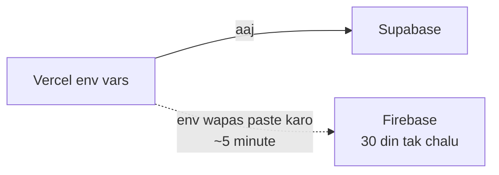

Cutover ke baad 30 din tak Firebase ko **mat mitana**. Rollback matlab sirf env vars wapas badalna hai — koi data restore nahi.

---

## 5. Ek nazar me — kya badlega, kya nahi

| Cheez | Aaj | Supabase pe | Farak |
|---|---|---|---|
| React components | JSX | JSX | **kuch nahi** |
| CSS / navy theme | app.css | app.css | **kuch nahi** |
| Print / A4 layout | wahi | wahi | **kuch nahi** |
| Parent portal ka feel | refresh-based | refresh-based | **kuch nahi** |
| Passwords | Firebase scrypt | wahi hash import | **kuch nahi** |
| Data read | `databaseRequest` | `supabase.from().select()` | badlega |
| Live update | `onValue` (har jagah default) | `channel()` (jahan chahiye wahin) | badlega |
| Reports | poora node + JS filter | SQL `where` | **bahut aasaan** |
| Field drift | `studentFromRow()` se sambhalna | column hi galat nahi ho sakta | **jad se khatam** |
| Multi-tenant safety | rules (verify nahi ho paate) | RLS (SQL se dikhte hain) | **behtar** |

---

## 6. Abhi kya karna chahiye

Migration ka faisla abhi nahi lena. Par **schema ka ye design Firebase me bhi laagu hota hai**:

- [ ] `attendance_summary` jaisa rollup node Firebase me banao (write ke waqt manual update)
- [ ] `TeacherApp.jsx:101` — poore school ke students hatao, sirf apni class (privacy ka masla hai, sirf perf ka nahi)
- [ ] `App.jsx:2818` — `fees` ka full-node listener → rollup + indexed query
- [ ] Attendance row se duplicate field hatao (`student_id`, `statusText`, `mark` — nayi rows me)
- [ ] Har mahine Firebase console pe usage dekho

Ye saara kaam **dono raaston me kaam aata hai.** Bekaar nahi jaayega.
